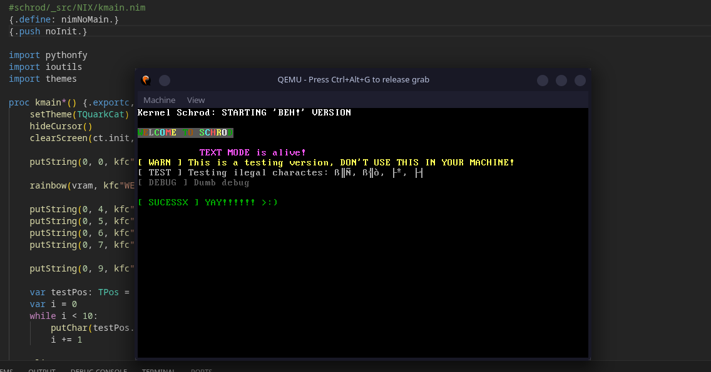

# Schrod: BEH! — Boot, Execute, Hope

> When a kernel is good, it runs Doom: even if it crashes.
Schrod still does not run Doom.
But now it would survive the attempt. - Devdeczin

## Q / A
---

### What is Schrod?
Schrod is an **experimental bare-metal freestanding kernel**, designed to test the limits of **Nim** — a language that, by design, assumes the existence of an operating system beneath it.

Here, that assumption does not exist.
Schrod was not designed to be pretty, comfortable, or complete. It was designed to **work where it shouldn't work**.

As far as we know, there are no “modern” kernels written in Nim following this approach. Nimkernel exists, but it is old, and other projects found are mostly direct forks. Schrod follows a different path: less compatibility, more control.


---

### But why? And how is it different from Nimkernel?
The short answer: **real learning**.

Like Nimkernel, Schrod is an educational project. The difference lies in its structural ambition. While Nimkernel remains restricted to its own basic functions, Schrod introduces:

* Visual themes
* Explicit abstractions (e.g., `putChar` → `putString` → `kprint`)
* Purposefully changeable architecture

The idea is to allow growth without everything breaking with every change. Think of Schrod as Nimkernel with sugar and frosting—still dangerous, but more expressive.

---

### How do I use Schrod?

You should **only** run Schrod in a virtualized environment.

Use QEMU to execute the ISO located at:

```
_src/NIX/bin/nixOUT/iso/schrod_BEH.iso
```

**Never** run this on a real machine.

This kernel can:

* Lock up the processor
* Permanently disable interrupts
* Write to unprotected memory regions

The section below explains how to compile and run Schrod relatively safely, without destroying VGA Text Mode.

---

### Why Nim? And why can't you compile with `nim c kernel.nim`?

Because this **is not standard Nim**.

Schrod uses **FINN**, a fork of Nim 1.6.20. This version was chosen because it is less rigid than more recent versions, which facilitates deep runtime removals.

Some features of modern Nim (such as `{.volatile.}`) are not directly available, but this is solved with specific modifications to the compiler.

Without FINN, Schrod **does not compile**. This is intentional.

---

## How to compile Schrod

> Warning: this section does not attempt to be simple. Kernel development is not simple.

### Dependencies

To compile Schrod, you will need:

* NASM
* GCC
* LD (Linux or WSL)
* grub-mkrescue / xorriso
* QEMU

Direct development on Windows is **not supported**.

---

### 1. Bootloader

Inside the `/NIX` directory, compile the bootloader:

```bash
nasm -f elf32 asma/boot.asm -o bin/boot.o
```

---

### 2. Compiling the kernel in Nim

After making changes to the code, use FINN to generate the objects:

```bash
finn c \
  --os:standalone \
  --cpu:i386 \
  --compileOnly \
  --noMain \
  --app:staticlib \
  --gc:none \
  --panics:off \
  --exceptions:goto \
  --overflowChecks:off \
  --rangeChecks:off \
  --boundChecks:off \
  --nilChecks:off \
  --assertions:off \
  -d:danger \
  -d:nimNoSystem \
  -d:nimNoRuntime \
  -d:nimBareMetal \
  --nimcache:build/nimcache \
  --out:build/kernel \
  kernel.nim
```

This command **only generates `.o` files**. No final binary exists yet.

---

### 3. Stubs in C (optional)

If you add stubs to `/C_files`, compile them manually:

```bash
gcc -c C_files/nim_runtime_stubs.c -m32 -ffreestanding -fno-builtin -nostdlib
```

Then compile the C files generated by Nim:

```bash
gcc -c build/nimcache/*.c -ffreestanding -nostdlib -m32
```

Organize the objects as you prefer. In the current project:

* Nim objects → `bin/nixOF`
* C objects   → `bin`

---

### 4. Linking

Now comes the part that really matters:

```bash
ld -T bin/linker.ld -m elf_i386 \
  bin/boot.o \
  bin/kernel_stubs.o \
  bin/nim_runtime_stubs.o \
  bin/nixOF/@mkmain.nim. o \
  bin/nixOF/@mioutils.nim.o \
  bin/nixOF/@mpythonfy.nim.o \
  bin/nixOF/@mthemes.nim.o \
  # add other objects here if necessary \
  -o kernelIsoCUSTOM.elf
```

If that worked, you have a valid ELF kernel.

---

5. ISO and execution

Copy the generated ELF to the `/behiso` directory, adjust the `grub.cfg`, and generate the ISO:

```bash
grub-mkrescue -o bin/nixOUT/iso/schrod_BEH.iso behiso
```

Run with QEMU:

```bash
qemu-system-i386 \
  -cdrom bin/nixOUT/iso/schrod_BEH.iso \
  -display gtk \
  -vga std \
  -no-reboot \
  -d guest_errors
```

If everything works, you will see exactly what you defined in `kmain.nim`.

Congratulations. You just did something that took weeks to understand.

---

## Windows (7–10)

Honest advice: **don't use Windows for kernel development**.

You'll spend more time fighting the system than learning Nim or architecture.

The recommended approach:

* Create a bootable USB drive (Ubuntu, Endeavour, etc.)
* Start in live mode
* Mount the Windows partition
* Follow the steps above

If that's not possible:

* Lie down.
* Cry.

Windows doesn't provide `ld` or `grub-mkrescue`, and improvising this isn't worth the pain.

If you still want to change something, open an issue on GitHub. If there's time (and courage), a new ISO can be generated.

---


## Future Projects

These projects **are not promises**, but natural ideas that arise from Schrod (I like Undermetal better):

- **Undermetal**
    A bare-metal game inspired by Undertale, running directly on Schrod.
    It includes simple battles, a life system, and a visual style similar to tools such as `nano` using VGA.

- **CatGhostOS**
    An operating system built on Schrod, seeking a technical middle ground between iOS/Darwin, Windows, and Linux.